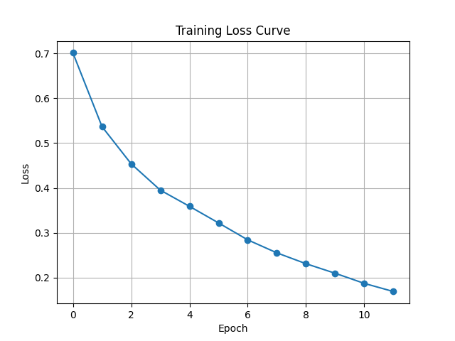
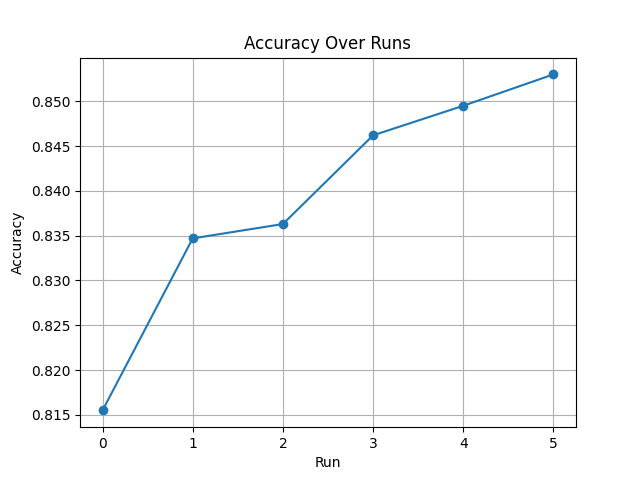
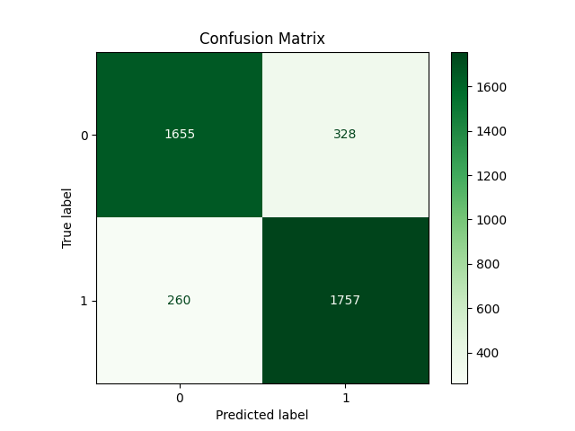

# 🎬 Sentiment Analysis using CNN (PyTorch)

A deep learning project that classifies movie reviews as **positive or negative** using a Convolutional Neural Network trained on the IMDB dataset.

Achieved **85.3% accuracy** through systematic experimentation, hyperparameter tuning, and model optimization.

This project simulates a real-world NLP pipeline, including data preprocessing, model training, debugging, evaluation, and deployment-ready inference.

---

## 💡 Why This Project

This project demonstrates how deep learning can be applied to understand human language and sentiment.

Such models are widely used in:

* Product review analysis
* Social media sentiment tracking
* Recommendation systems

---

## 🚀 Features

* Text preprocessing and cleaning
* Custom vocabulary creation and encoding
* CNN-based deep learning model
* Experiment tracking with parameter logging
* Training visualization (loss & accuracy trends)
* Real-time sentiment prediction system
* Handling uncertain predictions

---

## 🧠 Model Architecture

* Embedding Layer (128 dimensions)
* Convolutional Layers (filter sizes: 2, 3, 4, 5)
* Max Pooling
* Dropout (0.4)
* Fully Connected Layer

---

## 🎯 Demo (Command Line)

Run the app:

```bash
python app.py
```

Example Predictions:

Input: This movie was amazing and emotional
Output: Positive (Confidence: 99%)

Input: Worst movie ever seen
Output: Negative (Confidence: 96%)

Input: It's too good
Output: Uncertain (~60%)

---

## 📊 Training Visualization

### 📉 Loss Curve



Shows how the model loss decreases over epochs, indicating effective learning.

---

### 📈 Accuracy Over Runs



Shows improvement in model performance across experiments.

---

### 📊 Confusion Matrix



Shows how well the model distinguishes between positive and negative reviews.

---

## 📈 Experiments & Results

| Data Size | Epochs | Accuracy   |
| --------- | ------ | ---------- |
| 10k       | 6      | 0.8155     |
| 20k       | 8      | 0.8347     |
| 20k       | 10     | 0.8462     |
| 20k       | 12     | **0.8530** |

---

## 🚨 Key Debugging Insight

Initially, the model gave incorrect predictions due to a mismatch between training and inference vocabulary.

This issue was resolved by saving and reusing the same vocabulary (`vocab.pkl`), ensuring consistent input representation.

This significantly improved prediction reliability.

---

## 🛠 Tech Stack

* Python
* PyTorch
* Pandas
* Matplotlib
* Scikit-learn

---

## ▶️ How to Run

### 1. Install dependencies

```
pip install -r requirements.txt
```

### 2. Train the model

```
python train.py
```

### 3. Run prediction app

```
python app.py
```

---

## 📂 Project Structure

```
Sentiment-Analysis-CNN/
│
├── train.py
├── app.py
├── model.pth
├── vocab.pkl
├── accuracy_log.txt
├── requirements.txt
├── README.md
│
└── assets/
    ├── loss_curve.png
    ├── accuracy_runs.png
    ├── confusion_matrix.png
```

---

## 📚 Key Learnings

* CNN can effectively capture local patterns in text
* Model performance improves with more data
* Experiment tracking is crucial in ML workflows
* Training and inference consistency is critical
* Real-world ML involves debugging and iteration

---

## 🔮 Future Improvements

* Integrate pretrained embeddings (GloVe / Word2Vec)
* Upgrade to LSTM or Transformer-based models (BERT)
* Deploy as an interactive web application using Streamlit
* Improve handling of neutral and context-dependent sentences

---

## 👩‍💻 Author

Anjali Yadav
